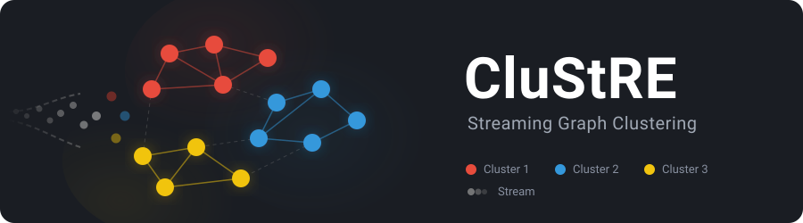

CluStRE v1.0
[](https://opensource.org/licenses/MIT)
[](https://isocpp.org/)
[](https://cmake.org/)
[](https://github.com/KaHIP/CluStRE/releases/latest)
[](https://github.com/KaHIP/homebrew-kahip)
[](https://github.com/KaHIP/CluStRE)
[](https://github.com/KaHIP/CluStRE)
[](https://github.com/KaHIP/CluStRE/stargazers)
[](https://github.com/KaHIP/CluStRE/issues)
[](https://github.com/KaHIP/CluStRE/commits)
[](https://arxiv.org/abs/2502.06879)
[](https://www.uni-heidelberg.de)
=====

<p align="center">
  
</p>

**CluStRE** (Streaming Graph Clustering with Multi-Stage Refinement) is a streaming graph clustering algorithm that achieves near in-memory quality while using a fraction of the memory. Part of the [KaHIP](https://github.com/KaHIP) organization.

> **Python Interface:** An easy-to-use Python interface for this software is available in [CHSZLabLib](https://github.com/CHSZLab/CHSZLabLib).

| | |
|:--|:--|
| **What it solves** | Get good graph clusterings super fast, or cluster graphs too large to fit in memory |
| **Objective** | Maximize [modularity](https://en.wikipedia.org/wiki/Modularity_(networks)) via streaming |
| **Key results** | 89.8% better quality, 2.6x faster, <2/3 memory vs. state-of-the-art streaming; achieves >96% of in-memory quality (Louvain) |
| **Algorithm** | Streaming assignment + quotient graph optimization + restreaming with local search |
| **Interfaces** | CLI |
| **Requires** | MPI, C++20 compiler, CMake 3.24+ |

## Quick Start

### Install

| Method | Command |
|:-------|:--------|
| **Homebrew** (macOS/Linux) | `brew install KaHIP/kahip/clustre` |
| **Build from source** | `./compile.sh` |

### Run

```bash
# Fast streaming clustering (light mode)
./deploy/clustre mygraph.graph --one_pass_algorithm=modularity --mode=light

# Best quality (strong mode: streaming + evolutionary + local search refinement)
./deploy/clustre mygraph.graph --one_pass_algorithm=modularity --ext_clustering_algorithm=VieClus --mode=strong
```

---

## Modes

CluStRE offers four modes that trade off speed, memory, and quality:

| Mode | Phases | Use case |
|:-----|:-------|:---------|
| `light` | One-pass streaming | Fastest, lowest memory |
| `light_plus` | Streaming + restream with local search | Good balance of speed and quality |
| `evo` | Streaming + memetic quotient graph clustering | High quality without restreaming |
| `strong` | Streaming + memetic clustering + restream with local search | Best quality, highest resource usage |

---

## Command Line Usage

```
./deploy/clustre <graph-file> [options]
```

### Required options

| Option | Description |
|:-------|:-----------|
| `<graph-file>` | Path to graph in METIS format (see [Graph Format](#graph-format)) |
| `--one_pass_algorithm=modularity` | Objective function for streaming (modularity is built-in) |
| `--mode=<mode>` | Clustering mode: `light`, `light_plus`, `evo`, `strong` |

### Common options

| Option | Default | Description |
|:-------|:--------|:-----------|
| `--ext_clustering_algorithm=VieClus` | `VieClus` | In-memory algorithm for quotient graph (used in `evo` and `strong` modes) |
| `--ext_algorithm_time=<seconds>` | `300` | Time limit for the in-memory clustering on the quotient graph |
| `--output_path=<directory>` | current dir | Directory for output files |
| `--suppress_file_output` | off | Suppress writing the clustering assignment file |
| `--evaluate` | off | Compute and store solution quality metrics |
| `--cluster_fraction=<0..1>` | ~5M clusters | Cap max clusters to `fraction * n` |
| `--cut_off=<0..1>` | `0.05` | Stop local search when gain < `cutoff * estimated_modularity` |
| `--ls_time_limit=<seconds>` | `600` | Time limit for local search phase |
| `--help` | | Print all available options |

### Output files

| File | Description |
|:-----|:-----------|
| `<graph>_<mode>.txt` | Clustering assignment (one cluster ID per line, 0-indexed) |
| `<graph>_<mode>.bin` | FlatBuffer binary with quality metrics, running time, memory usage |

### Example workflow

```bash
# 1. Cluster a graph in strong mode with 2-minute VieClus time limit
./deploy/clustre examples/rgg_n_2_15_s0.graph \
    --one_pass_algorithm=modularity \
    --ext_clustering_algorithm=VieClus \
    --ext_algorithm_time=120 \
    --mode=strong \
    --evaluate

# 2. Result files:
#    rgg_n_2_15_s0_strong.txt   (cluster assignments)
#    rgg_n_2_15_s0_strong.bin   (quality metrics)
```

---

## Graph Format

CluStRE uses the **METIS graph format**, the same format used by [KaHIP](https://github.com/KaHIP/KaHIP), Metis, Chaco, and the 10th DIMACS Implementation Challenge.

### Input format

A plain text file with `n + 1` lines (excluding comments). Lines starting with `%` are comments.

**Header line:**
```
n m [f]
```
- `n` = number of vertices, `m` = number of undirected edges
- `f` = format flag (optional): `0` = unweighted, `1` = edge weights, `10` = node weights, `11` = both

**Vertex lines (one per vertex):**
```
v1 [w1] v2 [w2] ...
```
where `v_i` are neighbor IDs (**1-indexed**) and `w_i` are edge weights (if `f=1` or `f=11`).

**Example** (4 vertices, 5 edges, unweighted):
```
4 5
2 3
1 3 4
1 2 4
2 3
```

### Requirements
- Undirected graph: every edge must appear in both adjacency lists
- No self-loops or parallel edges
- Vertex IDs are 1-indexed in the file
- Edge weights must be strictly positive; vertex weights must be non-negative

### 64-bit support
CluStRE supports 64-bit vertex and edge IDs by default. To disable, set `64BITMODE` and `64BITVERTEXMODE` to `OFF` in `CMakeLists.txt` and rebuild.

For a full description of the METIS format, see the [KaHIP manual](https://github.com/KaHIP/KaHIP/raw/master/manual/kahip.pdf).

---

## How It Works

CluStRE processes a graph in a streaming fashion, requiring only a fraction of the memory needed by in-memory approaches:

1. **Streaming phase**: Vertices are streamed one by one and assigned to clusters that maximize modularity gain. A quotient graph (cluster-level summary) is built incrementally.
2. **Quotient graph optimization** (`evo`/`strong` modes): The quotient graph is clustered using [VieClus](https://github.com/KaHIP/VieClus), a memetic algorithm that finds high-quality modularity-optimizing clusterings.
3. **Restreaming with local search** (`light_plus`/`strong` modes): The graph is re-streamed and vertices are reassigned using local search, refining cluster boundaries based on the improved quotient graph clustering.

This combination achieves over 96% of the quality of in-memory algorithms like Louvain while handling graphs that do not fit in memory.

---

## Building from Source

### Requirements

- C++20 compiler (g++ 10+)
- CMake 3.24+
- MPI (OpenMPI or Intel MPI)

All other dependencies (VieClus, FlatBuffers, STXXL, KaGen, abseil, robin-hood-hashing) are fetched automatically during the build.

```bash
git clone https://github.com/KaHIP/CluStRE.git
cd CluStRE
./compile.sh
```

The binary is placed in `./deploy/clustre`.

Alternatively, use the standard CMake process:
```bash
mkdir build && cd build
cmake -DCMAKE_CXX_COMPILER=g++ -DCMAKE_POLICY_VERSION_MINIMUM=3.5 -DCMAKE_CXX_FLAGS="-w" ../
make -j$(nproc)
```

---

## Data References

Graphs used in our experimental evaluation were sourced from:

| Source | URL |
|:-------|:----|
| SNAP Dataset | https://snap.stanford.edu/data/ |
| 10th DIMACS Implementation Challenge | https://sites.cc.gatech.edu/dimacs10/index.shtml |
| Laboratory for Web Algorithmics | https://law.di.unimi.it/ |
| Network Repository | https://networkrepository.com/ |
| Torch Geometric | https://pytorch-geometric.readthedocs.io/ |

Graphs were converted to METIS format with parallel edges, self-loops, and directions removed, and unit weights assigned to all nodes and edges.

---

## Related Projects

| Project | Description |
|:--------|:-----------|
| [VieClus](https://github.com/KaHIP/VieClus) | State-of-the-art memetic algorithm for highest modularity values |
| [KaHIP](https://github.com/KaHIP/KaHIP) | Karlsruhe High Quality Graph Partitioning (flagship framework) |
| [HeiStream](https://github.com/KaHIP/HeiStream) | Buffered streaming graph and edge partitioner |
| [KaHyPar](https://github.com/kahypar) | Karlsruhe Hypergraph Partitioning |

---

## Licence

The program is licenced under MIT licence.
If you publish results using our algorithms, please acknowledge our work by quoting the following paper:

```
@inproceedings{ChhabraPS25,
  author    = {Chhabra, Adil and Peretz, Shai Dorian and Schulz, Christian},
  title     = {{CluStRE: Streaming Graph Clustering with Multi-Stage Refinement}},
  booktitle = {23rd International Symposium on Experimental Algorithms (SEA 2025)},
  series    = {LIPIcs},
  volume    = {338},
  pages     = {11:1--11:20},
  publisher = {Schloss Dagstuhl -- Leibniz-Zentrum f{\"{u}}r Informatik},
  year      = {2025},
  doi       = {10.4230/LIPIcs.SEA.2025.11}
}
```
